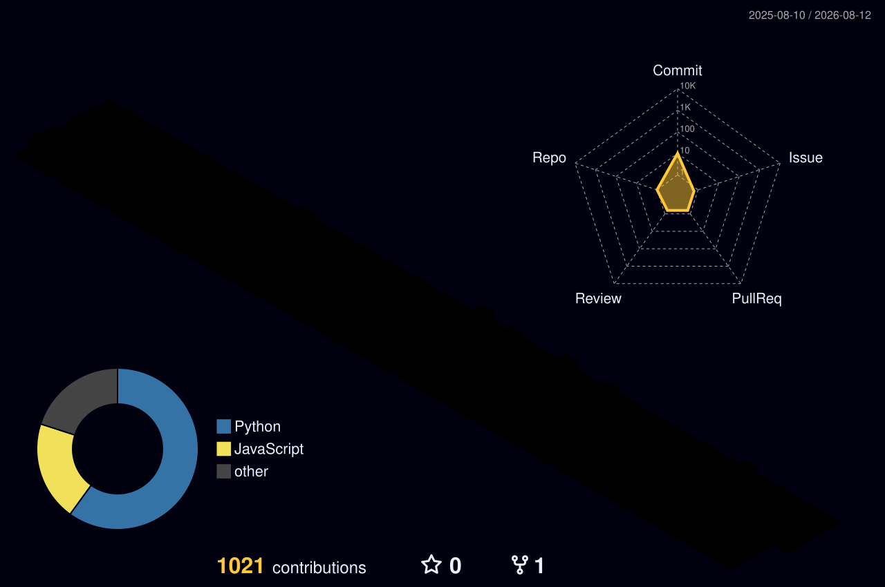

<div align="center">

<a href="https://github.com/GabrielBrunhara">
  
</a>

<br/><br/>

<a href="https://www.linkedin.com/in/gabriel-brunhara-049b43248/">
  
</a>

<a href="https://gabrielbrunhara.github.io/ReactPortfolio/">
  
</a>

<a href="mailto:gabrielbrunhara02@gmail.com">
  
</a>

<a href="https://github.com/GabrielBrunhara">
  
</a>


</div>

<br/>

## 🧠 whoami

```ts
const gabriel = {
  role: "Full-Stack Developer",

  location: "Curitiba, Brazil 🇧🇷",

  frontend: [
    "React",
    "Next.js",
    "TypeScript",
    "Tailwind CSS",
  ],

  backend: [
    "Laravel",
    "PHP",
    "Node.js",
    "REST APIs",
  ],

  database: [
    "PostgreSQL",
    "MySQL",
  ],

  tools: [
    "Docker",
    "Git",
    "GitHub Actions",
    "Linux",
  ],

  mindset: [
    "clean architecture",
    "performance",
    "automation",
    "shipping",
  ],

  mission:
    "turn real-world problems into software people actually use",
};
```

<br/>

## ⚡ Tech arsenal

<div align="center">

### Frontend


<br/><br/>

### Backend & Data


<br/><br/>

### Dev & Infrastructure


<br/><br/>

### Also explored


</div>

<br/>

## 🚀 What I build

<table>
<tr>
<td width="33%" valign="top">

### 🌐 Web Platforms

Modern interfaces and dashboards focused on usability, maintainability and performance.

`React` `Next.js` `TypeScript`

</td>
<td width="33%" valign="top">

### ⚙️ Backend Systems

APIs, integrations, business rules, authentication, queues and automated workflows.

`Laravel` `PHP` `REST`

</td>
<td width="33%" valign="top">

### 📊 Data-driven Apps

Applications that transform operational and financial data into useful products.

`PostgreSQL` `MySQL` `APIs`

</td>
</tr>
</table>

<br/>

## 📊 Under the hood

<div align="center">


</div>

<br/>

## 🏙️ Contribution skyline

<div align="center">



</div>

<br/>

## 🐍 Contributions never survive

<div align="center">

<picture>
  <source
    media="(prefers-color-scheme: dark)"
    srcset="https://raw.githubusercontent.com/GabrielBrunhara/GabrielBrunhara/output/github-snake-dark.svg"
  />
  <source
    media="(prefers-color-scheme: light)"
    srcset="https://raw.githubusercontent.com/GabrielBrunhara/GabrielBrunhara/output/github-snake.svg"
  />
  
</picture>

</div>

<br/>

<div align="center">

### Got a problem worth solving?

I'm probably interested.

<a href="mailto:gabrielbrunhara02@gmail.com">
  
</a>

<br/><br/>

<sub>
Code. Ship. Improve. Repeat.
</sub>

</div>


