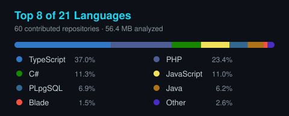

<!-- ══════════════ HEADER ══════════════ -->


<div align="center">

<a href="https://github.com/GabrielBrunhara">
  
</a>

<br/>

<a href="https://www.linkedin.com/in/gabriel-brunhara-049b43248/" target="_blank"></a> <a href="https://gabrielbrunhara.github.io/ReactPortfolio/" target="_blank"></a> <a href="mailto:gabrielbrunhara02@gmail.com"></a> 

</div>

<!-- ══════════════ ABOUT ══════════════ -->

## 🧠 whoami

```ts
const gabriel = {
  role: "Full-Stack Developer",
  location: "Curitiba, Brazil",
  frontend: ["React", "Next.js", "TypeScript"],
  backend: ["Laravel", "PHP", "Node.js"],
  mobile: ["React Native"],
  strengths: [
    "product-oriented development",
    "complex integrations",
    "end-to-end delivery",
    "production troubleshooting",
  ],
};
```

<!-- ══════════════ STACK ══════════════ -->

## 🛠️ Engineering toolkit

### Main stack

<p>
  
</p>

### Frontend & mobile

<p>
  
</p>

`React Native` · Responsive UI · Component architecture · Performance

### Infrastructure & delivery

<p>
  
</p>

`REST APIs` · `Webhooks` · `Queues` · `Payments` · `CI/CD` · `Monitoring`

<!-- ══════════════ STATS ══════════════ -->

## 📊 GitHub activity

<div align="center">





</div>

<!-- ══════════════ SNAKE ══════════════ -->

## 🐍 Contribution snake

<div align="center">
  <picture>
    <source media="(prefers-color-scheme: dark)" srcset="https://raw.githubusercontent.com/GabrielBrunhara/GabrielBrunhara/output/github-snake-dark.svg" />
    <source media="(prefers-color-scheme: light)" srcset="https://raw.githubusercontent.com/GabrielBrunhara/GabrielBrunhara/output/github-snake.svg" />
    
  </picture>
</div>

<!-- ══════════════ FOOTER ══════════════ -->

<div align="center">

  <em>"To live is to risk it all."</em><br/>
  <sub>— Rick Sanchez</sub>


